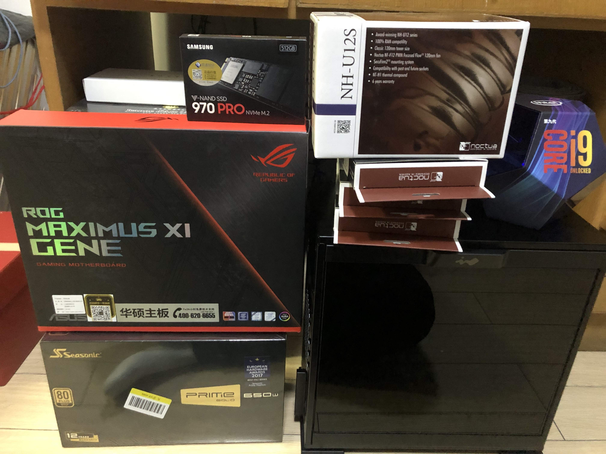
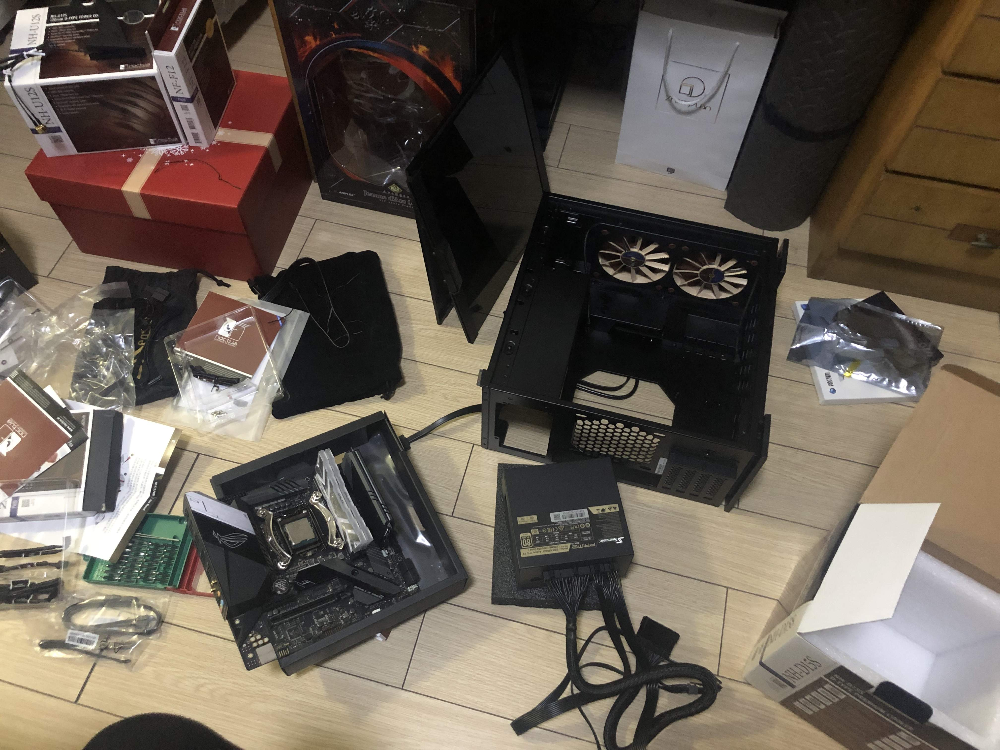
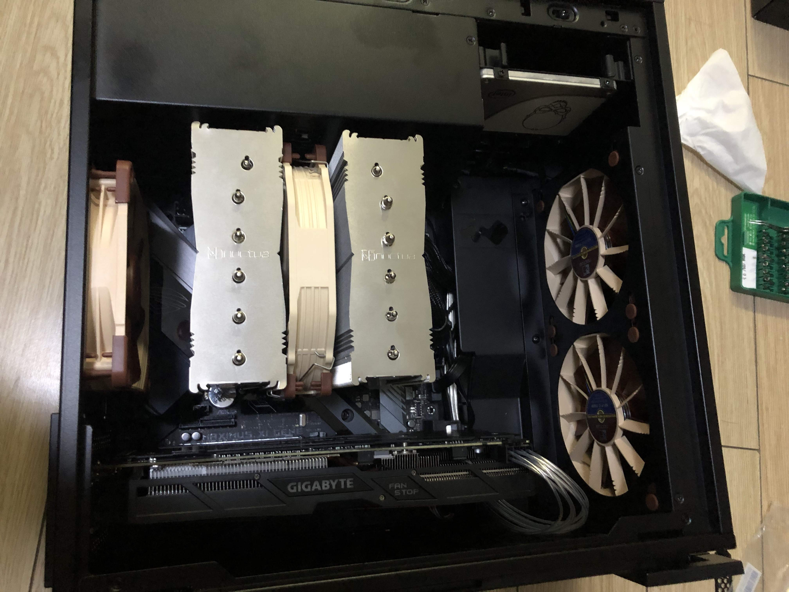

新的博客， 第一篇正好来说说最近装机的事情好了。旧的台式机还是2011年在学校的时候装的，I5 2500的cpu虽然老迈，不过说实话实际应用中几乎是完全够用的。而其他部件，内存加到了16GB，硬盘后来换了算是SATA SSD中顶级的intel 530，显卡前几年换了GTX1060，都是当前服役都算稳妥的配置。

换机的原因也只是DNF这个奇葩游戏打团居然会卡顿，我能想到的也就是CPU主频不够可能造成的。虽然I5 2500也能上到4Ghz，按理说频率也不差。不过算了，毕竟是老电脑了，换就换了吧。能提升一点是一点，此前公司的办公电脑从3代I3升级到6代I7的时候，本来以为区别不大，实际用起来系统响应还是流畅了不少的。

因为是时隔八年的装机，想了想干脆一步到位，免得以后折腾了，于是大部分配置都直接拉满了。

| 部件     | 名称                       |
| -------- | :------------------------- |
| CPU      | I9 9900K                   |
| 主板     | 华硕ROG M11G               |
| 内存     | 影驰HOF 3600 8Gx2          |
| 硬盘     | 三星970pro+INTEL 530（旧） |
| 电源     | 海韵 PRIME ULTRA 650W      |
| 散热     | 猫头鹰 D15S                |
| 显卡     | 技嘉1060 6G（旧）          |
| 机箱     | 迎广301黑色                |
| 机箱风扇 | 猫头鹰F12x3                |

301这个机箱不是什么新货，不过几年前看到的时候就比较喜欢这个外观，决定下一台电脑一定要用这个机箱，而实际选配置的时候还是纠结了好一会。因为9900K这个大火炉，不知道这个小机箱能不能压住（事后证明是多虑了）。

9900K当然是因为是顶配的关系，也顺利成章地选了华硕ROG的主板。唯一一款MATX的旗舰主板，而且有我比较需要的蓝牙和wifi。不过这款主板只有两个内存插槽的设计还是让我犹豫了很久，特别是看了下内存单条16G的价格。整机16G内存在现在也只能说是够用而已，如果这台新机也打算用上个5年8年的话，那是绝对不够的。如果有4插槽，那么以后想扩展内存配到32G就很容易。而32G在我看来是一个未来5年都比较安全的数字。但除了降规格选其他主板，似乎没什么好办法。想了想，就是充钱的事情，以后换两条16G的就完事了，就不纠结了。难得上一次顶配，不想有奇怪的缩水了。

第二个比较麻烦的是这个散热器，因为和301机箱的限高几乎一样，可能就装不进机箱了。另外也可能有挡其他配件的可能性，于是还买了一个U12S备用。其实301是一个支持水冷的机箱，上一体水冷可能是个更好的选择，在装机的时候更容易一些。不过考虑到水冷5年以后的可靠性，我还是选择装机的时候麻烦一点吧。

新硬件全家福，比预想的要少，机箱的盒子比较大，拆了就不装回去了。这里散热器是先到的U12S，但实际装机用的是D15S，后者规模更大。机箱也比预想的要大，其实就是常见的机箱大小，可能是一般DIY偏好的中塔ATX机箱都比较大的关系，显得迎广这种大小中规中矩的机箱也算比较小了，也可能是我看惯了一般品牌机ITX机箱大小的关系。迎广这个机箱一把风扇都不带，于是额外买了三把猫扇，这个开支也不小。

这个机箱常规的风道设计是下进风，前后出风。算是比较照顾显卡散热的一个风道，因为进风离显卡非常近。但在我这套配置里，主要的发热大户是CPU，所以我很自然的改成了前进风，后出风，显卡靠自带风扇排风。在实际使用中，显卡大部分时候根本不用风扇，甚至自带的风扇都是停转的。而主机内包含CPU风扇在内一共4把风扇，实际使用中基本没有风噪。只有都开起aida64单烤FPU的时候能感受到风扇噪音。作为噪音敏感用户，对这个效果我是满意的。

因为一些原因，这个装机流程横跨了整整一周，期间所有东西都堆在地板上，我不得不把扫地机器人的定时任务也停掉了。关于装机过程中的麻烦事主要来自这个机箱和散热器。对于选择风冷侧吹散热真的是比预想的要痛苦。简单描述一下装机过程中的问题就是，我把主板在机箱里固定好之后，安装过程必须严格按照先装内存，再装散热器，然后装散热器风扇，接着插显卡，最后按照电源，这个顺序来进行。装散热器前先装了电源呢，散热器的风扇就扣不进去。先装散热器再插内存呢，卡槽被挡住了。

其中有一次，装完散热器我发现显卡走线不对想拆了显卡重装。于是不得不先拆掉电源，然后拆散热器风扇，然后拆散热器，最后才能拔显卡，一个步骤都不能少。于是就这么反复折腾了好几趟。另外这个电源自带的CPU供电线只有一条8pin的，而华硕这个超规格主板给CPU提供了8pinx2的供电，于是我又上淘宝买了定制线。既然买了定制线，就顺便把显卡的8pin供电线也买了，因为自带的是双8pin的接口，空出一个看着难受。定制线确实对于狭窄空间内走线确实帮助很大，不过301这个机箱空间并不算机箱，所以最后也没有把所有的线都换成定制线。另外选择海韵这款电源也有一些帮助，因为这个电源比标准ATX电源短一些，机箱上部留的走线空间就相对多一些。

裸机测试点亮。某次拆卸机箱的时候，把机箱侧板的卡扣拆坏了，提给京东报修。然后后面我就把这堆东西裸放在桌子上用了两天。。。

全部装完的样子。走线方面我也算尽力了，正面的线材基本都绕在主板边缘布线解决。机箱预留的开口一个也没开，全部用原有的开口解决。不得不说风冷的巨大散热器对于整体布局结构真是巨大的破坏，如果换成水冷，机箱内部能清爽不少吧。

整机搭建完成，装完系统以后单烤FPU测试了一下，温度稳定在83度左右，烤了十几分钟，实际散热器也不是很热，估计稳定也差不多就这温度了。至于超频啥的，9900K也算官超比较猛了，进一步压榨意义也不大了。

最近觉得超频这事就像加班一样。招人的时候，如果对方说可以接受加班，甚至高强度加班，可能确实是个加分项。但实际工作中又不见得真的会让人去这么加班，加班多也未必就能代表高产能，超频也是这么回事吧。