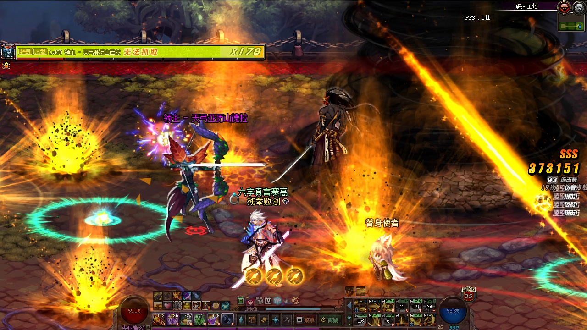

前阵子游戏上录了几个视频, 传到b站, 顺便学了点视频编辑和压制的知识. 主要是`x264`和`ffmpeg`相关的. 不过浅尝辄止, 这部分就先不展开说了.

由于b站最高能支持1080p的视频上传, 而录的游戏视频原始分辨率是720p的. 720p一方面本身分辨率不如1080p, 另一方面对码率的限制更严.(1080p能上传6k码率的视频, 720p最高只能上传3k码率). 根据我压视频的经验, 码率上升带来的画质提升是大于分辨率上升带来的负担的. 因此有条件当然是传1080p的更好.

这就涉及到视频upscale的问题. 几年前用过`waifu2x`做一些图片的放大, 效果还不错, 一些比较老的低分辨率图片放大到高分辨率后可以拿来做现在显示器或者手机的壁纸. 不过视频的upscale我推测和单纯图片的放大还是不太一样, 因此还是趟了点坑.

拿自己录的原始720p视频作为素材, 第一步是拆帧. 因为`waifu2x`本身只支持图片放大, 所以需要把视频先逐帧拆成图片. 可以用`ffmpeg`拆, 也可以用`adobe premire`. 如果视频需要先编辑的话, 建议就直接用pr编辑完导出图片序列了. 纯拆帧用`ffmpeg`也很快, 命令格式如下`ffmpeg -i <video_file_name> <image_name>_%05d.png`. `%05d`是指定图片序列的名字, 如果视频很长的话, 也可以将位数扩长. 当然图片太多的话, 本身用`waifu2x`也会有性能问题.

接着就是导进`waifu2x`里面跑了. 因为之前我下载的是带gui的版本, 直接选择图片所在目录, 指定渲染的参数就好了. 作为参考, 我用的放大2倍, 开3级降噪, 对720p图片做放大, 速度大约是1秒1张. 2分多钟60帧的视频,  `waifu2x`渲染完大约用了1小时50分钟, 显卡是gtx1060 6g版本, 应该说还是挺久的.

最后在pr里导入图片序列再合成视频即可. 因为是图片合成, 声音自然是没有的. 将原先视频的声音合并进来就好了, 这一步不管用pr还是ffmpeg都很快. 最后再导出视频, 这一步又会花不少时间. pr的h264实现据说效果不如x264. 但是无损格式导出实在太大了. 暂时没有配置帧服务器, 所以我是先用pr导出码率较高的版本, 再用x264压制一遍上传的版本. 两步各会花费视频时间2~5倍的压制时间. 因为视频不长, 所以还算可以接受.

渲染完的视频可以参考这个链接.[waifu2x渲染测试视频](https://www.bilibili.com/video/av92874251)

## 一些坑

`waifu2x`渲染本身对于图片质量有一定要求, 如果图片很糊的话, 渲染效果会比较差, 因此就对视频源的质量有比较高的要求. 哪怕是本来实际观感还可以的视频, 如果本身码率不足, 拆完的图片有一些细节丢失的话, 对渲染的画面会有比较大的影响. 也就是说, 对于`低分辨率低码率视频->低码率图片->waifu2x渲染->高码率高分辨率图片->高码率高分辨率视频`, 最终出来的高分辨率视频, 观感不会很好.

实际测试下来, 比较适用的场景是`低分辨率高码率视频->高码率图片->waifu2x渲染->高码率高分辨率图片->高分辨率高码率视频->高分辨率低码率视频`. 这种路径是是适用的, 最终压制完上传到视频网站的视频可以保持如6k这种方便网络传输的码率. 但是原始视频需要的可能是高一个数量级的码率(比如这里我的测试视频使用了60k的码率).

另外一个有意思的现象是, `waifu2x`对图片做降噪的时候, 会有明显的画风变化, 产生类似"油画感". 这种风格对于动画风格的图片, 不得不说还蛮受用的, 在很多场合下效果都不错.

不过这种变化随着图片分辨率的上升会呈下降趋势, 对于720p的图片, 降噪后"油画感"很明显, 升上到900p, 乃至1080p后, "油画感"逐渐消失. 对同一张图片, 原始分辨率是1440p, 逐步下降下720p, 对比比较明显. 参考下图. 第一张是原图, 第二张是经过`waifu2x`渲染后的. 因为上传博客原因, 尺寸统一缩到了720p, 不过画风变化还是可以直观看出来.

个人猜想是因为随着分辨率上升, `waifu2x`在渲染时能补充的细节变少, 因此这种画风变化也逐渐变少. 如果比较想要这种滤镜效果, 且原始图片(视频)分辨率较高, 那么还要做一次downscale. 这方面也有一些不错的算法, 不过我暂时也没空折腾这些, 就不展开讲了.