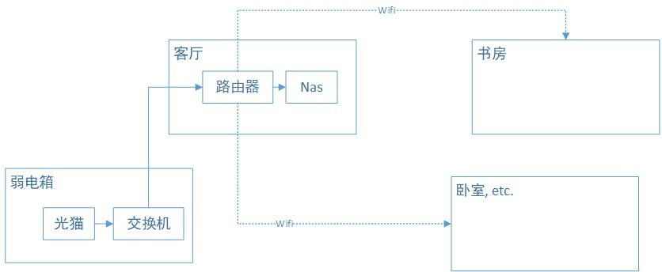

从去年搬家以来，我就保持着极简的局域网环境。光纤入户后，用客厅里的路由器拨号上网，除了和路由器放在一块的nas以外，其他所有设备，包括电视、电脑以及其他智能设备，都是通过wifi接入，结构上非常扁平，简单。而且过去的这一年多时间里也很少遇到实际问题，就一直这么用着。

虽然大问题没有，但是我也清楚这套结构是有很大的不足的。主要是受限于单路由器的信号限制，放在书房的主力电脑，连接到路由器的速度大概只有10\~20MB/s。虽然在重启或关闭wifi重新打开后，速度可以短暂的恢复到60MB/s，但是之后又会降到不足一半的程度。我推测的原因是书房和客厅之间虽然没有实体墙堵着，但是书房的门如果关上了，对于信号敏感的5G频段的wifi还是会受到干扰，导致降速。除此之外，像笔记本电脑连着wifi备份也会碰到网络断开导致备份失败。因为我差不多一周才会把电脑带回来备份一次，备份失败多少还是有点影响的。

而促使我下决定进行调整的直接原因，则是偶然发现当电脑和nas之间进行大文件传输的时候，网络延迟已经会严重影响游戏上的延迟时间了。看起来内网的带宽已经比连接公网的带宽可能还小了，这确实太影响上网体验了。

这里简单说下网络环境，如图所示：

虽然各个房间之间与弱电箱都通过交换机布置了网线，但是遗憾的是每个房间都只有一条网线，包括客厅。因此如果要保持由客厅的路由器拨号的话，那么是没有第二条线能把信号回传给交换机，再与各个房间连接的。对于网络拓扑我也是个外行，大概了解到有两个办法可以解决，一个是客厅里加一个交换机，设置vlan；另一个是把弱电箱的交换机换成路由器。前者实施起来有一点门槛，后者则受限于弱电箱的格局，要加设备也比较困难。

在网上发帖求助之后，看到一个有意思的方案。就是把客厅的路由器升级成mesh wifi路由，并在每个需要较高带宽的房间里单独部署一个mesh路由。好处自然是部署简单，而且完全不受环境约束。当然mesh路由也支持无线回程，如果路由器之间还是通过网线连接的话，带宽和延迟保障会更好一点。但是这个方案最吸引我的地方还是在于可以全部使用无线的方式解决问题。某种意义上，这也算是以科技进步的方式，影响了房子的物理结构吧。

整个过程实施起来也很方便，我从京东上下单了两台小米的ax6000路由器作为试验。先用一台测试取代了现有的主路由进行测试。wifi的连接速率在60~70MB/s左右，和我原先的路由器在刚连接上wifi时差别并不大。接着再激活第二台路由器，并配置好与第一台路由器结成mesh网络，整个过程操作都比较简单，照着说明书操作即可。配对好以后把第二台路由器放到书房里并接好电源。这里我分别测试了电脑与路由器通过wifi的方式和网线的方式连接，两者相差不大，实测从nas上拷贝文件，速率在110MB/s左右。考虑到这可能已经是受限于nas硬盘的读取速度了，我觉得这个速率毫无疑问已经是让我满意的了。后续如果卧室或其他房间对于网速较高要求的话，也都可以考虑通过这种方式解决。

值得一提的是，由于路由器之间依旧是通过无线连接的，因此在位置的布置上就比较随意了。客厅的路由器依旧受限于与光猫之间的连接，因此我放在了电视机柜上，也还算比较隐蔽。书房里的路由器则被我放在书架的底层。我个人很喜欢这种把这类基础设施类设备摆放隐蔽的做法。毕竟我需要的只是网络信号，而不是在家里哪个显眼的位置摆放一个祭台，像供奉神灵一样把wifi信号请来。mesh路由对于布置位置的随意性也是相当好，只要能接上电，放在哪里都行。我想这类设备最好的做法可能是像电灯一样装在天花板上。不过眼下这样一台可以随意摆放的设备也已经能满足我的需求了，就不多折腾了。
