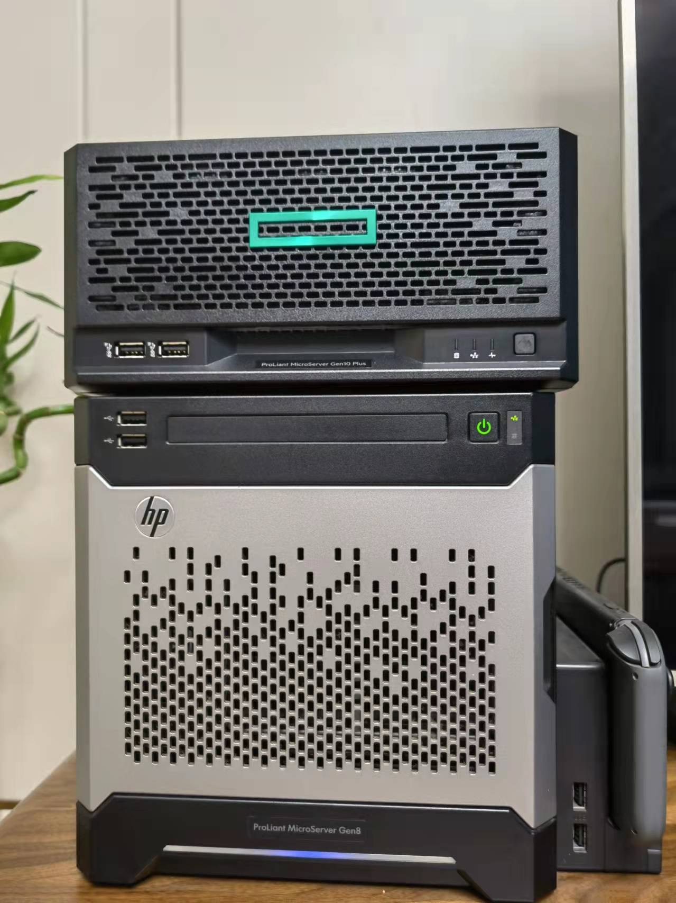
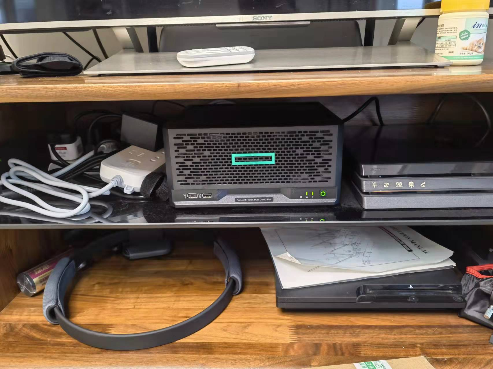

## 起因

我客厅的电视柜边角上，放着一台HP Gen8，我把它用做网络存储，一直以来都工作的很好，也不算太突兀，很多来家里的客人都不觉得这是一台电脑，也许以为是音箱或是电视机顶盒之类的东西。作为一台有四个3.5寸硬盘位的电脑，我本来也觉得这个体积已经算是极限了，在迈入全固态存储时代前，我是没有办法把这样一台设备像ps5或是路由器一样塞到柜子里面的，直到去年我的Gen8电源开始出现问题，然后我在搜索后续替代品的时候看到了下一代产品Gen10 Plus。

同样的四盘位机箱，相比Gen8，仅仅少了光驱和用不了几次的硬盘快捷插拔前面板，但是高度却缩减了整整一半，真的变成了一台像路由器一样的设备，考虑到Gen8我已经使用了6年以上，升级换代的理由已经很充分了。

购买之前我也考虑过，如果Gen8再撑几年的话，理想的下一代NAS产品该是什么样子。我脑子里想到的两条我最关心的是：1、arm架构；2、纯SSD存储。

想到这两条并非是我的什么特殊偏好，而是因为我发现我对NAS产品最大的需求，就是体积，而实现这两点都可以让NAS产品的体积有比较显著的下降，从而在一个近乎“隐身”的状态下提供尽可能多的存储容量。

不过考虑到这两点短期内要实现确实不太现实，因此Gen10 Plus有理由成为在完全实现这以目标前的一代过渡产品。

当然，往更长远考虑的话，完全的云存储在未来也是可能的，只是这里的不确定性，更多取决于未来云存储是否能有合理的商业模式，以及作为基础的网络设施能到什么程度了，这就不展开说了。

## 购买

Gen10 Plus在国内并没有像Gen8当时那样有正常的购买渠道，对比了海淘和其他国内代购商家后，我选择了从computeruniverse网站海淘。这或许并不是一个正确的选择，因为去年的疫情原因，最终这台电脑在下单两个多月的时间之后才配送到了我手里。不过考虑到其他硬盘等配件我也是等到双十一才购买的，所以这段等待时间倒也不算是什么问题。

最终完整的采购部件包括这些东西

| 部件                            |
| ------------------------------- |
| Gen10 Plus Xeon  E2224 16GB RAM |
| Gen10 Plus iLO5 kit共享卡       |
| 佳翼 NVMe转接卡 PCIE转M.2       |
| 西数 SN750 1TB                  |
| 东芝 14TB MG08ACA14TE  *2       |

硬盘理论上可以配满4块，不过我准备还是一步一步来，先用两块把原来的数据转移过来再说。大容量机械硬盘很多人吐槽噪音会比较大，因此先买两块也是出于先扫雷的想法。SSD用了Gen10 Plus唯一的PCIE插槽，是有一点浪费。一些扩展卡支持转接更多的SSD，或者是附带高速的网络接口。不过因为暂时没有需求，也就先用着了。

## 硬件组装

刚拿到机器的时候，我开机看了一下，意识到这次需要折腾的会比Gen8要少很多。原因是当时Gen8的风扇实在太吵了，于是花了不少功夫去魔改电源和风扇。

因此这次就是简单的把所有的零件插上，拧上螺丝就好了。唯一没想到的是硬盘的固定方式，虽然一开始知道不像前代Gen8那么简单，不过螺丝固定的方式还是有点超乎我的预期，在网上找了几篇评测才找到怎么固定的说明。

装完后整个扔到电视机柜里，没有额外研究怎么把前指示灯关掉，整体存在感还算比较低，就先不折腾了，至此算是开始正常服役了。

## 系统搭建

上一代Gen8我使用的主机系统是Windows server2012，对于其他系统的需求则通过Hyper-V安装虚拟机解决。

我细想了一下过去几年里主机操作系统的选择是否给我带来了多少便利或是不便，从纯粹的网络存储设备角度上来说，Windows的频繁更新重启带来的只有不便，从应用软件的角度看，我也并不强依赖于Windows生态下的软件。唯一值得一提的可能是硬盘监控软件Disk Sentinel，它确实让我在使用过程中，特别是硬盘过保后超期服役期间，更加安心了。

这当然并不足以成为我把平台留在Windows的理由，最终我安装了Exsi作为宿主系统，一个Truenas虚拟机提供基础的存储服务，并把SATA控制器直通给这个虚拟机。对于其他软件的需求（由于Truenas并非linux系统，不支持docker，这类情况恐怕还不少），再通过其他虚拟机挂载网络存储后对外提供服务。

我并没有组建raid，Truenas和ZFS我了解不多，我也并不打算依靠raid来保障数据安全，对我来说，这两块硬盘仅仅就是两块硬盘而已。对于数据安全的问题，就留给下次说明吧。
