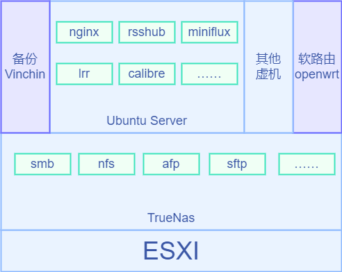

## 重构

这篇博客在两个月前写完后，我一直觉得有点不满意，内容上虽然已经把现在做完的东西都讲了一遍，感觉没有重点，而且对于homelab提供的软件服务部分，本身就是在一直迭代更替的，全都更新在一篇里面感觉也不合适。思来想去，决定重构一番，本篇内容只集中在系统搭建上，对于软件的部分，将分篇章逐篇论述。

## 底层系统

本着所有系统都虚拟化了方便管理备份的原则，这次底层采用的是esxi。不过这只是凭着过去几年的刻板印象选的，事前没有做过很完善的调研，事后想想，也许PVE会更合适。

gen10 plus的唯一的pcie卡槽我用来接了m2转接卡来使用ssd作为系统盘，esxi本身是否放在ssd上并不重要，这块盘更主要的作用是存储虚拟机系统。不过因为sata控制器计划是直通给上层的nas虚拟机使用，所以底层系统自然是需要有独立的介质存储的，能存在机器里面多少还是比插u盘方便一些。整个pcie槽位只用来接一块ssd其实有点浪费，理论上来说分拆成2~4个m2接口或者提供2个2.5G网口都是可行的。不过支持这些功能的转接卡价格会高很多，同时和机器本身也可能存在这样那样的适配性问题。因为暂时来说我的需求只要接一块ssd就够了，所以就姑且先只用单接口的转接卡就行。

由于这次的iLO与Gen8存在一些差别，底层系统的安装比起gen8稍微要波折一点，设置gen10plus的iLO配置需要先找一台显示器接上，在BIOS中设置好iLO使用共享网口的相关配置，配好以后就可以把机器插上网线塞到柜子里去了，后面的环节都可以通过iLO远程配置。

安装esxi的过程很快，底层系统安装完成后，后面的系统安装都可以在esxi的web端进行。

## truenas(文件服务)

首先是安装truenas系统，在esxi中上传系统镜像并创建虚拟机，再把sata控制器直通给truenas即可。出于稳妥考虑，这里我安装的系统是`truenas core`，因为是基于freeBSD的系统，从便利性上来讲可能会差一些。如果需要额外的功能，就需要用其他虚拟机来支援了。

不过事后发现这么做带来的一个好处。由于sata控制器被直通给了truenas，整个truenas系统要做备份就变得比较困难，把整个存储系统做的比较简单，复杂的软件服务集中在独立的虚拟机上，单独对这些虚拟机做备份就比较简单了。

在使用上，这套系统只用于提供存储服务使用，存储池定义，用户ACL设置，设置smb、nfs、afp、webdav等文件服务，其余功能一概不用。这样一来，整套系统除了存储的数据以外，就只有配置信息了。只要定期备份配置（这些配置变动其实也是比较少的，所以备份的频次也会很低），就能防备系统发生故障后能够顺利恢复。

硬盘数据的备份，是个很复杂的方案，这个以后再具体展开讲。

## ubuntu server(docker宿主)

因为除了基础的文件服务，通常我还会用到很多额外的软件服务，所以需要至少一套额外的虚拟机来充当软件服务器，之所以说是至少一套是因为部分软件如果限定了特定平台（比如windows），那么单独一套linux server是搞不定的，不过目前这种情况没有，所以我就先只装了一套linux系统，后面有需要再按需安装。

这里选什么系统倒是并不重要，大部分server软件都会以docker方式运行，所以并没有区别。选ubuntu一方面是延续原有的使用习惯，另外是考虑到部分软件或命令行工具会以原生方式安装，选个保有量大的版本很多时候会更方便(和买车一个道理)。

## openwrt(软路由)

这个系统只是实验性质，我对软路由的主要需求是流量控管与监控以及透明代理。目前尝试下来效果还不太令人满意，就不展开讲了。只能说折腾网络设备确实是最麻烦的，一个没配置好导致断网就很麻烦。即便作为尝试，我已经是只拿这套系统做旁路由使用，但是在底层esxi部署好以后，大部分时间我都是在外面通过代理方式访问家里的局域网设备，所以一旦中断，可能这天都干不了什么了...

## vinchin(系统备份)

因为ubuntu server上做了很多配置和安装的活计，此外除了server，我也还有其他几套用途的虚拟机需要备份。查了一下感觉vmware的备份方案都挺重的（这也是让我觉得一开始如果用的是PVE可能就没那么多事了）。相对而言vinchin（云祺）的这套方案还算不错。唯一的问题是付费模式主要面向企业用户，不太适合个人用户。好在有永久的免费授权可以一直使用，只是有三台虚拟机的限制。

## 结语

最后整理一下，系统整体结构图如下，还算清晰吧。

系统的搭建到这里基本告一段落了。可能还会再尝试一些软路由系统，或是出于软件需要装个windows server之类的小变更，也没必要展开说了。

后续的重点会放在软件服务的构建上，这些就逐篇展开再慢慢说吧。