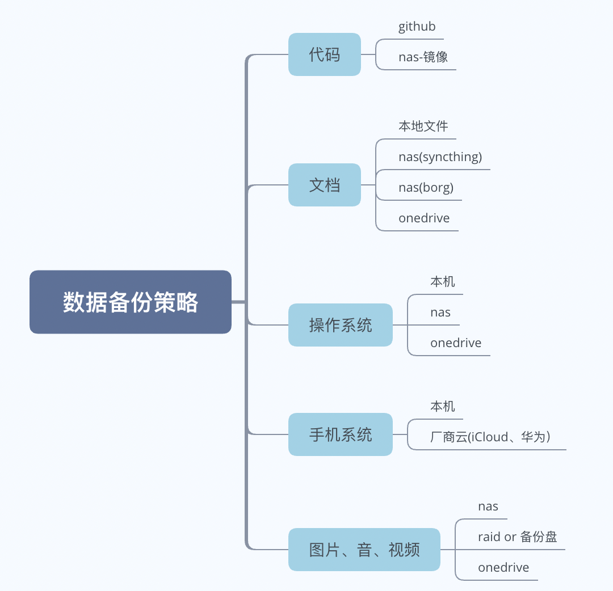

## 前言

想不到距离上一次写完新nas的硬件已经两个月过去了。这段期间其实也算是没有闲着，鼓捣着不仅搭完了nas系统，也顺带折腾了其他几个虚拟机，目前除了硬件上可能会在下一次618的时候补齐剩下的硬盘，姑且算是告一段落了，也算是来做一个总结。

## 系统

本着所有系统都虚拟化了方便管理备份的原则，这次底层采用的是esxi。不过这只是凭着过去几年的刻板印象选的，事前没有做过很完善的调研，事后想想，也许PVE会更合适。

gen10 plus的pcie位接了转接卡以后接了m2 ssd作为系统盘使用，当然esxi本身其实不需要放在ssd上，这块盘更主要的作用是存储虚拟机系统。

这里比起gen8稍微有点波折的一点是，设置gen10plus的iLO配置还是需要先找一台显示器接上，在BIOS中设置好iLO使用共享网口的相关配置，配好以后就可以把机器插上网线塞到柜子里去了，后面的环节都可以通过iLO远程配置。

安装esxi的过程会很快，之后再通过esxi控制台安装truenas系统，将sata控制器直通给truenas。之后truenas也是全部通过网页端访问管理。平心而论，我虽然装的truenas，但是并不是很在意zfs。因为目前只有两盘位，所以用一块盘创建池子存储个人文件，另一块用于存储影音媒体文件。目前个人数据在gen8与gen10之间属于互备性质，还算安稳。等剩下两块盘补上的时候，是拿出一块组个人文件的镜像，还是三块盘一股脑拼起来存媒体文件，倒是需要斟酌一下。

在使用上，truenas完全被作为提供存储服务使用，除了定义存储池，开放如smb、afp、webdav等服务外，其他的插件一类的东西就一概没用了。加上本身安装的truenas core版本也不支持docker。因此又安装了一个ubuntu server的虚拟机，来运行一些额外的服务，通过虚拟交换机加smb的方式访问nas上的资源。对于esxi虚拟交换机的性能我没怎么研究，也许只有千兆水平，不过对我目前是够用的。

除此之外，还安装了一个openwrt作为旁路由。因为这台server会用于像pt下载、数据上传到网盘备份等用途，会占用大量带宽，使用openwrt来做流控与qos，希望能更好的保障网络质量吧。

## server应用

### 1. 代理与DDNS

在硬件部署完成以后，剩下的步骤都可以通过网络来配置，也就意味理论上可以在任何能上网的地方配置，当然前提是我能够访问到家里的局域网。

国内的电信运营商要求家用宽带不能用于提供互联网服务的、在实际场景上，家用宽带被扫到任意端口上提供了web服务会被视为违约，同时也考虑到局域网应用暴露到公网的风险性，先通过vpn的方式连接到家里的网络，算是比较稳妥的方式，暴露在公网的端口也会较少，安全性上面也算是经得起考验。不过实际方案上，我用v2ray替代了vpn作为代理使用。

远程访问需要解决的第二个问题是ddns，这个其实用路由器或者truenas提供的功能也够用了。因为我手头有几个托管在aws域名，就定义了一个二级域名，在ubuntu server上起一个定时任务，检测当前IP是否变更，如果有变就用aws-cli做域名解析的更新。

端口映射部分除了代理服务之外，我还单独开了server上的ssh服务，不过建议修改默认端口并关掉密码登录，或者是使用`Fail2Ban`这类软件防止恶意爆破。

这样配置好以后，上班或者出门在外的时候，都可以通过web端或是ssh登录到服务器上，折腾剩下的东西，或是进行数据整理一类的管理事务。

### 2. PT

基础的bt客户端其实qbittorrent和transmission都挺好的，我也没具体对比过两者的差别。就随手装了qbittorrent，以及对应的web管理工具qbittorrent-nox。有一个小问题是ubuntu server20.04目前对应的qbittorrent-nox版本是不支持管理rss的，直接一条`apt-get install qbittorrent-nox`的结果并不理想，需要照着官网操作步骤单独安装最新版本。当然事后想想直接拉个docker镜像也是可以的。

其实我的下载需求靠这个客户端就基本满足了，有进一步追剧需求的也可以看一下sonarr和radarr这两个软件。

### 3. 同步与网盘

在把gen8的存量数据迁过来的过程，我用到了`syncthing`，感觉还不错，于是这次也拿来作为nas上文档同步使用。`syncthing`不像onedrive或是iCloud能做到按需同步，因此主要用于做文档的全量同步使用。

此外还有`BaiduPCS-Go`用于备份数据到百度网盘，`rclone`用于备份数据到onedrive，还有`borg backup`用于文档的增量备份。关于数据备份的方式，下文会再具体展开讲，工具部分基本就是以上提到的这些。

### 4. 其他服务

对于家庭服务器，我个人还是希望更多承载一些不方便使用公有云或互联网公司已有产品的服务。像是代码托管、网站或是邮箱之类，现有的产品服务已经做的挺好了，而且近乎免费，个人觉得没必要由个人服务器来。

目前觉得用处比较大的是**使用calibre搭建个人书库**。虽然现在各类出版物电子版出的越来越多了，不过个人多少还是有一些非正式出版物，或是其他渠道获取的书籍。同时，即使理解是出于DRM的原因，自己购买的电子书只能在单一的app内阅读依旧是一件让人不爽的事情。在这方面，calibre虽然不算多好用，不过确实的起到书籍管理的作用。通过`apache guacamole`，可以通过web端访问应用的图形界面，也算是接近了数据集中管理的问题。

另外照片管理也可以列作一项，各大厂商对于相册消耗空间的收费还是较高的，而且各个厂商云对于设备更替多少还是有一些不友好。虽然云厂商提供的相片的识别分类功能也确实很好用，好在现在也有photoprism这样的应用，使得个人部署的相册服务也能有类似的分类功能。

## 备份

解决数据安全问题是我这次新组建nas的重要目标。为此，我提前整理了自己的数字资产情况，并按照"3-2-1"的原则设计备份策略，即三份数据副本，使用两种不同的介质，一份存储在异地。整体情况如下：

对于代码，也许是出于github的天然信任，此前其实我并没有考虑过任何备份策略。不过体验过近段时间的俄乌形势影响后，我觉得还是需要稍加防备。`github-backup`这个python工具库可以很简单的解决这个问题，在nas定期跑一次就行了。

对于文档，本着同步不能视为备份的原则，通过syncthing同步到nas的版本不被视为一个备份。而通过`borg backup`给文档做增量备份，不仅解决了自动备份的问题，还增加了文档的版本管理，算是一举多得，同时备份到onedrive上，解决异地备份问题。

操作系统我本来认为不是那么重要的东西，不过实践下来发现备份起来也还算容易。pc和服务器上的虚拟机我通过vinchin这个软件进行定时备份，mac则通过timemachine直接备份到nas上。归功于现在的网络环境上行带宽充足，这些备份同样可以上传到onedrive完成异地备份。

而手机的操作系统因为做不到类似的本地备份，就干脆放弃了，好在各个手机厂商也有提供备份服务，总归算是有一点保障的。

图片、音、视频（这里主要指个人拍摄或录制的内容），因为消耗存储极大，也算是个麻烦事。这里也是我一开始纠结的事情，数据存放在网盘，应该只视为一个备份吗？其实我对于存放在网盘上的数据还是比较放心的，丢失的可能性并不高。网盘主要的风险在于政策性风险，万一停止服务或是改变运营策略，会带来不小的影响。但是从安全性上来说，本地的数据丢失了，从网盘恢复一份，除了速度可能慢一点之外，其他方面其实并不怎么用担心。

这里选用onedrive也是主要考虑了下载效率比较高，商业版提供无限的存储容量，其实实际数据如果小于10TB的话，百度网盘的性价比会更好，不过百度网盘在数据安全性和提供的下载效率少要差一些。其实未来如果个人数据的增长要慢于硬盘降价速度的话，选用云计算厂商的对象存储服务也是不错的选择，只是目前性价比还不是特别好。

整个备份过程比我预想的要快。本地电信宽带的上行带宽通常都限制在30Mbps，不过意外发现可以临时购买提速包，下行速度虽然没有提升，但是上行速度可以提升到100Mbps。在初次上传到网盘期间使用，一周时间就把存量4TB左右的视频与图片全部传到了网盘上。至于平时的增量备份，目前的30Mbps似乎也够用了。

## 后续

截止本篇写完，这台服务器已经持续运行了150天，这也算是整体虚拟化后带来的好处吧，除了极少的硬件维护以外，基本不存在中断服务的情况。All in one带来的风险，固然存在。不过上一代gen8即使在我一通改造以后，使用起来也算稳定。加上还算完备的备份机制，各类软硬件的风险，我并不是很担心。