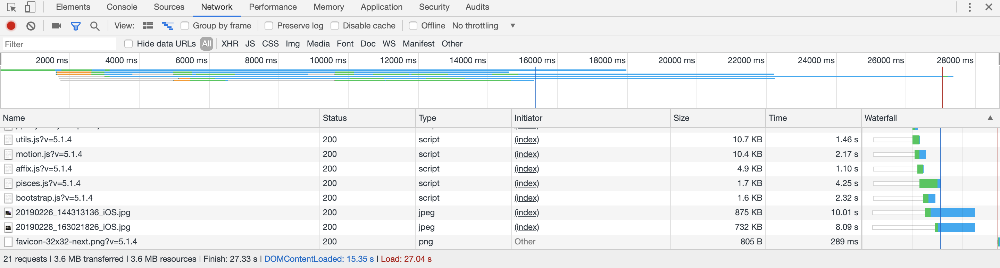
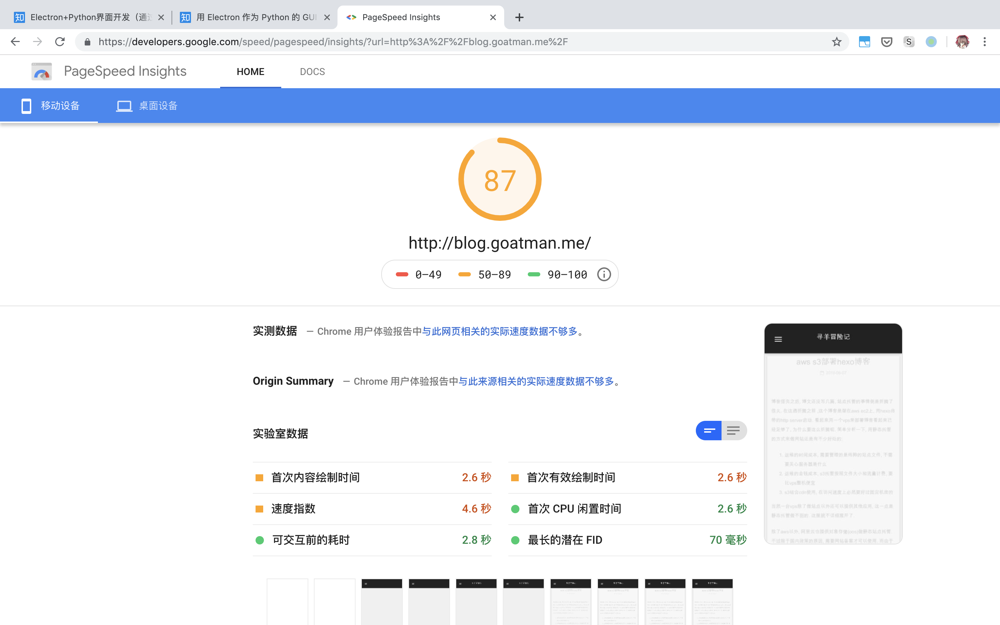

# hexo页面性能优化

继上篇最后给s3增加了cdn之后, 访问性能其实还算堪堪够用, 剩下倒是些细枝末节的优化. 虽然俗话说过早的优化是万恶之源. 不过身为程序员的代码洁癖还是让我忍不住把这些问题处理掉.

## 发现问题

如何发现性能问题是第一步. 对于网页访问的响应速度分析, 最简单的粗暴的做法是通过浏览器控制台自带的响应时间捕捉数据. 以chrome开发工具为例

这里我测试的是加载部署在aws ec2上的hexo博客的情况, 并且使用的是手机4g作为热点. 可以看到加载时间长达27秒. 其中dom文档下载花费了15秒, 而所有资源(主要是图片)则是耗时长达27秒.

另外一个选项, 对于互联网网页, 可以用google的[pagespeed insights](https://developers.google.com/speed/pagespeed/insights/)对网页进行彻底的分析. 使用这个分析的另一个好处是, 在pagespeed insights上获得高评分有利于提高在搜索引擎上获得的权重.(即seo优化)

下图是本博客在优化前的评分情况.

除了提供评分以后, pagespeed insights还提供了很多优化建议. 比如延迟加载屏幕外图片, 在header中增加cache时间, 使用gzip做文本压缩等.

## 性能优化

### 优化图片加载

那么优化的第一步就以图片为例, 图片加载的优化路子有很多. 比如这里的图片大小高达800kb,虽然这已经是我在原始照片的基础上做了有损压缩的结果, 但是对于网页而言, 这个尺寸还是大了一点. 比较合适的做法应该是在网页上提供一个低保真的缩放(将图片分辨率降低比如800x600的尺寸, 并降低图片质量), 同时提供如点击后浏览大图的功能. 这也是我认为比较好的一个策略. 

实施这一做法也有很多办法. 我搜到一个比较新奇的做法是用aws lambda做实时的图片处理. 这个做法的优势在于可以做任意尺寸的图片缩放. 但是采用实时压缩, 我个人觉得在响应速度上并不存在优势. 另一个做法是在hexo生成博客的时候, 同时生成多份图片资源, 比如生成如`xx_tumb.jpg`格式的缩略图供内嵌页面使用, 并在点击查看大图时, 使用`xx.jpg`的链接. 

遗憾的是似乎没有现有的hexo插件可以提供这一功能, 暂时性的, 我使用的是`hexo-lazyload-image`这个插件, 间接避免了加载过多图片的问题. 当然这个插件依旧不能避免当首页有大图时的问题, 这个问题就留给以后优化了.

### 增加缓存时间

在header中增加CacheControl的做法有很多种. 这里我的做法是在将文件上传到s3时增加相应标签. 使用的部署插件是自己改写的s3部署插件, 然后注意在cloudfront中保留原始的header内容.

完成后通过浏览器访问, 并在控制台查看header中是否有对应内容即可.

### 增加gzip压缩

gzip压缩主要针对html页面或是js脚本等, 能提供比较客观的流量压缩. 如果是使用nginx或者apache等web服务器的话, 一般都有实时的gzip压缩功能. 不过遗憾的是s3并没有这个功能. 本来想着可以在部署阶段先通过gzip压缩, 然后再发布到s3上. 同时在header中增加`encoding=gzip`. 这当然也是一个可选的做法, 但是这么做的话, 如果客户端使用不支持gzip格式的浏览器(虽然可能性几乎为0), 那么就无法访问了.

好在s3虽然没有提供压缩功能, 但是cf提供了. 在cf中将压缩选项打开, 就会自动根据资源类型进行压缩.(只压缩html、js脚本等资源)

cf的变更需要一定时间生效. 稍后通过浏览器查看, 同样可以在response header中看到encoding相关内容. 另外, 也可以与压缩前的文件大小做对比, 文本文件通常可以降低2/3的大小.

## 复核pagespeed insights评分

pagespeed insights的评分有一定滞后性, 可能是google会对网页做缓存的缘故. 下图是上述优化都生效以后的评分情况.

这时候的评分就理想多了. 虽然还存在一个首次有效绘制时间过晚的问题. 猜测是next这个主题引起的, 要等到页面相关的资源(html、css、js等)全部就位以后才会绘制页面.

这个就暂时不管了, 等有时间研究next主题了, 再来考虑这个优化.